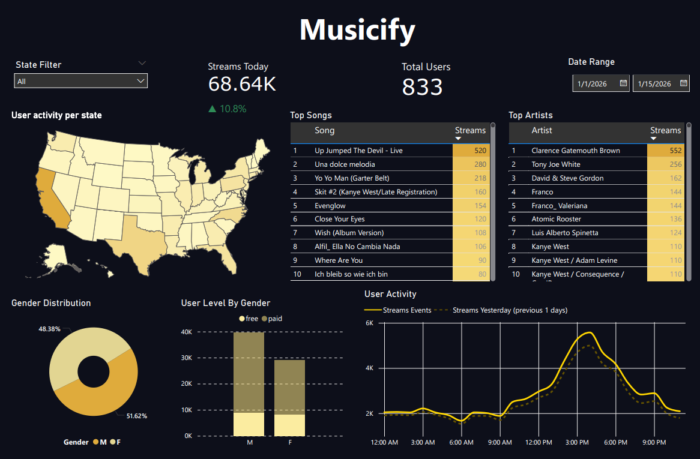

# 🎵 Musicify - End-to-End Local Data Pipeline

Một dự án Data Engineering hoàn chỉnh xây dựng luồng xử lý dữ liệu từ Streaming đến Batch Processing sử dụng Kafka, Spark, HDFS, dbt, Docker và Power BI.

## 📌 Description

### Objective
Dự án mô phỏng quá trình thu thập và xử lý luồng sự kiện (events) theo thời gian thực từ một ứng dụng nghe nhạc giả lập (tương tự Spotify). Dữ liệu bao gồm các hành vi của người dùng như: nghe nhạc, chuyển bài, đăng nhập. 

Luồng dữ liệu (Data Pipeline) sẽ bắt các sự kiện này, xử lý và lưu trữ xuống Data Lake (HDFS). Sau đó, hệ thống Transformation (dbt) sẽ nhào nặn dữ liệu thô thành cấu trúc Star Schema (Fact & Dim tables) để phục vụ cho việc trực quan hóa. Cuối cùng, Power BI sẽ kết nối để hiển thị các chỉ số phân tích kinh doanh (Top bài hát, Nhân khẩu học, Xu hướng nghe nhạc...).

### Dataset
Dự án sử dụng [Eventsim](https://github.com/Interana/eventsim) để sinh ra dữ liệu hành vi người dùng hoàn toàn giả lập nhưng có logic tương tự dữ liệu thực tế. Eventsim sử dụng tập dữ liệu bài hát từ [Million Songs Dataset](http://millionsongdataset.com).

### 🛠️ Tools & Technologies
Kiến trúc của dự án được triển khai hoàn toàn trên môi trường Local thông qua các container.
- Containerization - [**Docker**](https://www.docker.com), [**Docker Compose**](https://docs.docker.com/compose/)
- Data Generation - **Eventsim** (Scala)
- Stream Processing / Message Broker - [**Kafka**](https://kafka.apache.org)
- Data Processing - [**Apache Spark**](https://spark.apache.org/docs/latest/streaming-programming-guide.html) (kết hợp Spark Thrift Server)
- Data Lake / Storage - **Hadoop Distributed File System (HDFS)**
- Data Transformation - [**dbt** (Data Build Tool)](https://www.getdbt.com)
- Data Visualization - **Microsoft Power BI**

### 💻 Development Environment (Môi trường phát triển)
Dự án được tối ưu để chạy trên môi trường Linux. Nếu bạn sử dụng Windows, hệ thống được thiết lập và vận hành thông qua:
- **Hệ điều hành:** Windows 10/11 với **WSL 2 (Windows Subsystem for Linux)** - Bản phân phối **Ubuntu**.
- **Code Editor:** **Visual Studio Code** kết hợp với extension **WSL** (hoặc Remote - SSH) để lập trình, gỡ lỗi và thực thi lệnh trực tiếp bên trong môi trường không gian của Ubuntu.
- **Terminal:** Ubuntu Bash.

### 🏗️ Architecture
*(Thay thế ảnh này bằng sơ đồ kiến trúc thực tế của dự án nếu có)*

### 📊 Final Dashboard

---

## 🚀 Setup & Execution Guide

Dự án được chia thành các module độc lập nhưng liên kết chặt chẽ với nhau thông qua Docker Network. Để chạy dự án trên máy local của bạn, vui lòng làm theo thứ tự các tài liệu hướng dẫn cấu hình chi tiết dưới đây:

*Lưu ý: Yêu cầu máy tính đã cài đặt sẵn Docker và Docker Compose.*

1. **Khởi tạo Data Generator & Message Queue:**
   - [Setup Kafka & EventSim](setup/kafka.md)
2. **Khởi tạo Data Lake & Processing Engine:**
   - [Setup HDFS & Spark Cluster](setup/spark.md)
3. **Chuyển đổi dữ liệu (Data Transformation):**
   - [Setup dbt (Data Build Tool)](setup/dbt.md)
4. **Trực quan hóa (Data Visualization):**
   - [Kết nối Power BI với Spark Thrift Server](setup/powerbi.md)

---

## 💡 Future Improvements (Định hướng phát triển)
- Tích hợp **Apache Airflow** để tự động hóa (orchestration) lịch trình chạy của Spark và dbt mỗi giờ/mỗi ngày.
- Nâng cấp dbt models từ `table` (Full refresh) sang `incremental` để tối ưu chi phí tính toán.
- Áp dụng kiến trúc Lambda để xử lý dữ liệu song song (Batch & Real-time).
